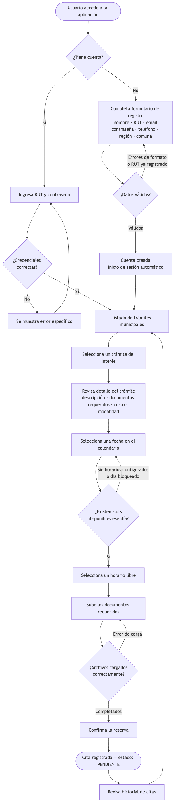
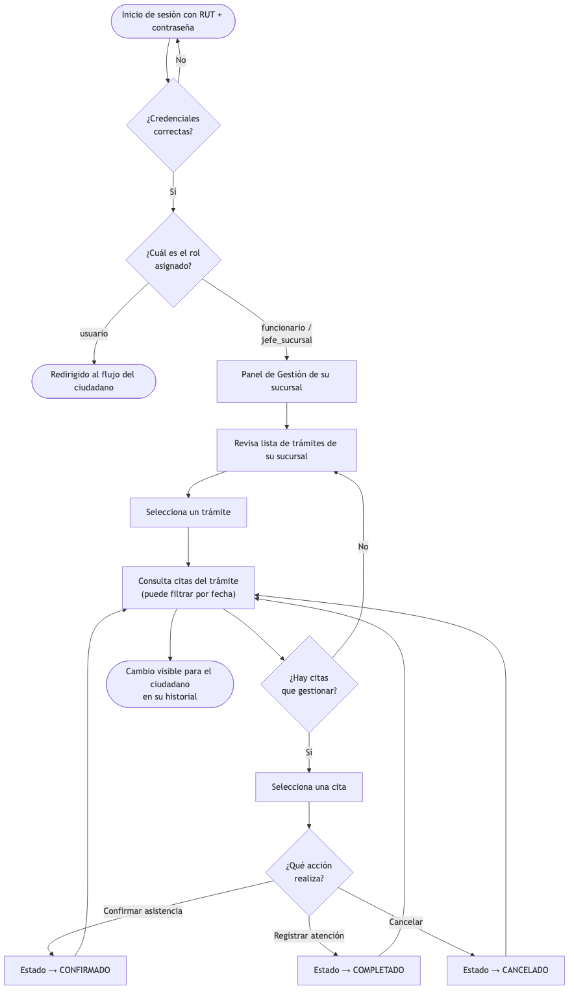

# Municipalidad Santo Domingo — Plataforma de Trámites

## Integrantes

- Felipe Astudillo
- Martina Sandoval
- Daniel Cornejo
- Diego Zúñiga

Aplicación web y móvil para gestionar trámites municipales: agendamiento de horas, subida de documentos e historial de citas.

**Stack:** React 19 + Ionic 8 + TypeScript · Node.js + Express (backend) · Supabase (base de datos, autenticación y storage)

---

## Justificación del proyecto y usuario objetivo
Actualmente, la Municipalidad de Santo Domingo enfrenta un grave déficit en la digitialización de sus trámites. Esta carencia obliga a la ciudadanía a acudir presencialmente para agendar sus citas, exigiendo a las personas invertir tiempo extra en trasladarse, solicitar la atención y esperar para que le den una hora (en caso de que le den una). El principal problema radica en la falta de opciones para realizar estas solicitudes vía web, lo que genera distintas consecuencias negativas:

- Para la ciudadanía: Congestión en las sucursales físicas, pérdida de tiempo y frustación debido a la falta de claridad en los documentos que se necesitan, las pocas horas disponibles o la modificación/cancelación de estas sin un motivo concreto.
- Para el municipio: Existe una sobrecarga para los funcionarios, lo que dificulta la gestión eficiente de las citas, la mezcla de todos los documentos (físicos y digitales).

Por lo tanto, este proyecto busca solucionar esta problemática mediante el desarrollo de una página web intuitiva y fácil de usar para todo tipo de usuarios (desde jovenes hasta adultos mayores) centrada principalmente en agendar, gestionar y hacer un seguimiento de los trámites en línea. De este modo, se espera optimizar los recursos municipales, mejorar la eficiencia en los servicioes y dar una respuesta a las necesidades de los usuarios.

---

## Requerimientos

### 1. Requerimientos Funcionales

| ID | Rol | Nombre | Descripción | Criterio de Aceptación |
|---|---|---|---|---|
| RF-01 | Usuario | Agendar hora | El usuario puede agendar una hora seleccionando el tipo de examen (Licencia Clase A, B, etc.) e indicando si es primera vez o renovación. | Al confirmar, la cita queda registrada en el sistema con todos los datos del examen seleccionado. |
| RF-02 | Usuario | Gestión de la reserva | El usuario puede modificar o cancelar una cita previamente agendada desde su panel personal. | El usuario puede cambiar fecha, hora o tipo de examen, o cancelar la cita, y los cambios se reflejan de inmediato en el sistema. |
| RF-03 | Usuario | Visualización del historial | El sistema muestra el registro completo de exámenes agendados por el usuario, con el detalle de cada trámite. | El historial lista todas las citas del usuario ordenadas cronológicamente con sus datos completos visibles. |
| RF-04 | Usuario | Seguimiento de estado del examen | El usuario puede consultar el estado actualizado de su trámite (Aprobado, Rechazado, En Proceso) para el proceso de entrega de licencia. | El estado del trámite se muestra correctamente en el perfil del usuario y se actualiza cuando el administrador realiza cambios. |
| RF-05 | Usuario | Lista de espera | Si no hay disponibilidad en las fechas deseadas, el usuario puede unirse a una lista de espera y recibe una notificación automática si se libera un cupo. | Al liberarse un cupo, el sistema notifica automáticamente al primer usuario en lista de espera para ese bloque horario. |
| RF-06 | Usuario | Validación de identidad | El sistema integra validación por RUT para garantizar que cada persona pueda tener solo una hora vigente a la vez. | Un RUT con cita activa no puede agendar una segunda hora hasta cancelar o completar la existente. |
| RF-07 | Usuario | Modificación de datos de contacto | El usuario puede actualizar su correo electrónico, número de teléfono u otros datos de contacto desde su perfil. | Los nuevos datos quedan guardados y se usan en las notificaciones siguientes. |
| RF-08 | Funcionario / Jefe de Sucursal | Gestión de capacidad y bloqueos | El funcionario puede bloquear días o franjas horarias específicas por feriados, mantenimiento o ausencia de personal. | Los días bloqueados se aplican de inmediato al calendario visible por los usuarios. |
| RF-09 | Jefe de Sucursal | Exportación de nóminas diarias | El sistema genera automáticamente listas de asistencia diaria en formato PDF o Excel con los datos clave de cada postulante agendado para ese día. | El jefe de sucursal puede descargar la nómina del día en cualquiera de los dos formatos con todos los campos requeridos. |
| RF-10 | Funcionario | Buscador y editor de citas | El funcionario puede buscar a un usuario por RUT, modificar su hora agendada o registrar asistencia manual. | El funcionario encuentra al usuario por RUT y puede editar o registrar su cita sin errores. |
| RF-11 | Jefe de Sucursal | Configuración de reglas de negocio | El jefe de sucursal puede editar parámetros del sistema como la duración de cada tipo de trámite y el número máximo de cupos por día. | Los cambios en los parámetros se aplican al flujo de agendamiento de forma inmediata. |

---

### 2. Requerimientos No Funcionales

| ID | Categoría | Nombre | Descripción | Criterio de Aceptación |
|---|---|---|---|---|
| RNF-01 | Usabilidad | Interfaz intuitiva para todo rango etario | La interfaz debe ser clara y fácil de operar para usuarios de todas las edades, usando textos legibles, botones de tamaño adecuado, iconografía de apoyo y un flujo de agendamiento guiado paso a paso sin ambigüedades. | Un usuario mayor de 60 años sin experiencia previa puede completar el flujo de agendamiento sin asistencia en su primer intento. |
| RNF-02 | Accesibilidad | Cumplimiento de estándares de accesibilidad web | El sistema debe cumplir con las pautas WCAG 2.1 nivel AA, garantizando contraste de colores suficiente, navegación por teclado, etiquetas descriptivas en formularios y compatibilidad con lectores de pantalla. | La aplicación supera una auditoría de accesibilidad automatizada (Lighthouse) con puntaje igual o superior a 90 en la categoría Accessibility. |
| RNF-03 | Rendimiento | Soporte de carga concurrente | El sistema debe mantener tiempos de respuesta aceptables con al menos 100 usuarios activos simultáneamente, sin degradación visible en la carga de páginas ni en el proceso de agendamiento. | Bajo una prueba de carga de 100 usuarios concurrentes, el tiempo de respuesta promedio del servidor no supera los 3 segundos y no se registran errores de disponibilidad. |

---

## Sistema de roles

| Rol | Descripción | Permisos |
|-----|-------------|----------|
| `usuario` | Ciudadano registrado | Ver trámites, agendar citas, subir archivos, ver su historial |
| `funcionario` | Trabaja en una sucursal | Todo lo anterior + ver y gestionar citas de su sucursal, configurar horarios y bloquear horas |
| `jefe_sucursal` | Administra una sucursal | Todo lo anterior + crear/editar trámites de su sucursal, registrar funcionarios y asignarlos |

El login se realiza con **RUT + contraseña**. La autenticación usa JWT generados por Supabase Auth. 

(El RUT ya no tiene que existir necesariamente, puede ser cualquiera que cumpla con la validación básica)

(Hasta el momento en el proyecto solo se ve reflejado el rol de usuario con sus respectivas funciones, el rol de funcionario y jefe de surcursal aún no estan implementados).

---

## Arquitectura de navegación

El sistema diferencia dos flujos de navegación según el rol del usuario autenticado: el flujo del **ciudadano** (rol `usuario`) centrado en el agendamiento de trámites, y el flujo del **personal municipal** (roles `funcionario` y `jefe_sucursal`) orientado a la gestión de citas. Ambos flujos comparten el punto de entrada (login/registro) pero divergen inmediatamente después en función del rol detectado.

---

### Rutas de la aplicación

| Ruta | Acceso | Descripción |
|------|--------|-------------|
| `/` | Pública | Redirige automáticamente a `/login` |
| `/login` | Pública | Inicio de sesión con RUT + contraseña |
| `/registro` | Pública | Registro de nueva cuenta ciudadana |
| `/tramites` | Autenticado (todos los roles) | Listado de trámites municipales disponibles |
| `/tramite/:id/detalle` | Autenticado (todos los roles) | Detalle de un trámite específico |
| `/tramite/:id/agendar` | Autenticado (todos los roles) | Selección de fecha y slot horario |
| `/tramite/:id/subir` | Autenticado (todos los roles) | Subida de documentos y confirmación de cita |
| `/historial` | Autenticado (todos los roles) | Historial de citas del usuario autenticado |
| `/panel-funcionario` | Solo `funcionario` y `jefe_sucursal` | Panel de gestión de citas por sucursal |

Las rutas protegidas requieren sesión activa; sin sesión el usuario es redirigido a `/login`. Las rutas con restricción de rol redirigen a `/tramites` si el rol no coincide, sin exponer la existencia de la ruta restringida.

---

### Flujo del ciudadano (rol `usuario`)

El flujo completo desde el acceso inicial hasta la confirmación de la cita, incluyendo puntos de decisión y desvíos posibles:



---

### Flujo del funcionario y jefe de sucursal

El flujo del personal municipal diverge tras el login según el rol asignado al perfil:



---

### Puntos críticos de interacción y coherencia

| Punto | Descripción |
|-------|-------------|
| **Autenticación con RUT** | El login opera con RUT (no email). El backend localiza el perfil por RUT, verifica la contraseña con `bcrypt.compare()` y delega la generación del JWT a Supabase Auth. RUT inexistente o contraseña incorrecta devuelven 401 sin distinguir cuál falló, evitando enumeración de usuarios. |
| **Verificación de disponibilidad** | Los slots horarios se generan en tiempo real combinando tres fuentes: `horarios_tramite` (horario base por día de semana), `bloqueos_horario` (días u horas inhabilitadas por funcionarios) y `citas` existentes con estado distinto de `cancelado`. Solo se presentan los slots realmente libres. |
| **Control de acceso por rol** | `PrivateRoute` intercepta cada navegación antes de renderizar. Sin sesión → redirige a `/login`. Con rol insuficiente → redirige a `/tramites`. El backend replica la misma validación de rol de forma independiente como segunda capa de seguridad. |
| **Subida de documentos** | La carga es asíncrona con barra de progreso individual por archivo. Los archivos se almacenan en Supabase Storage y solo cuando todos están cargados correctamente se habilita la confirmación de la cita. |
| **Transición de estado de cita** | Las citas siguen la secuencia `pendiente → confirmado → completado` o pueden ser `cancelado` en cualquier punto. Solo `funcionario` y `jefe_sucursal` pueden modificar estados vía `PUT /citas/:id/estado`; el backend valida JWT y rol antes de procesar. |
| **Coherencia de sesión** | Al iniciar la app, `AuthProvider` recupera el token de `localStorage` y lo valida con `GET /auth/me`. Si el token expiró o fue alterado, se elimina automáticamente y el usuario es redirigido a `/login` sin intervención manual. |

---

### Jerarquía de vistas

```
App
├── Rutas públicas
│   ├── LoginPage
│   └── RegisterPage
└── Rutas protegidas (requieren sesión activa)
    ├── Tramites                        ← vista raíz para todos los roles
    │   └── DetalleTramite
    │       └── AgendarHora
    │           └── SubirArchivos
    ├── HistorialTramites
    └── PanelFuncionario                ← exclusivo: funcionario / jefe_sucursal
```

---

### Justificación técnica

**React Router v5 + IonReactRouter.**
Se usa React Router v5 (no v6) por compatibilidad estricta con `IonReactRouter` de Ionic 8, que envuelve el router para inyectar las transiciones de página nativas (slide entre pantallas, fade en modales) propias de aplicaciones móviles. Migrar a v6 rompería estas animaciones porque la API de renderizado de rutas cambió de forma incompatible.

**Componente `PrivateRoute` centralizado.**
En lugar de proteger cada vista individualmente con lógica duplicada, se encapsula el control de acceso en un único componente de orden superior (HOC). Cualquier cambio en la política de autenticación o roles se aplica desde un único punto sin tocar cada página. El componente encadena tres verificaciones en orden: carga inicial → autenticación → rol, garantizando que nunca se renderice contenido protegido antes de que el estado de sesión esté resuelto.

**`AuthContext` (React Context API) en lugar de Redux o Zustand.**
El estado de autenticación necesita ser accesible en tres niveles: rutas (`PrivateRoute`), componentes de layout (`Header`) y páginas individuales. Context API cubre exactamente este alcance sin el boilerplate de un store global. Introducir Redux o Zustand solo para gestionar el usuario autenticado sería sobredimensionar la solución para el problema actual.

**JWT almacenado en `localStorage`.**
Se eligió `localStorage` sobre cookies de sesión porque Capacitor —la capa de empaquetado que permite generar la app para iOS y Android— no gestiona cookies HTTP entre el WebView nativo y el servidor de la misma forma que un navegador de escritorio. `localStorage` es accesible de manera uniforme desde el WebView de Capacitor en todas las plataformas objetivo sin configuración adicional.

**Redirección silenciosa en caso de rol insuficiente.**
Cuando un usuario intenta acceder a una ruta para la que no tiene permisos, `PrivateRoute` lo redirige a `/tramites` en lugar de mostrar una página de error 403. Esta decisión tiene dos motivaciones: primero, no expone la existencia de rutas restringidas a usuarios no autorizados; segundo, mejora la experiencia al llevar al usuario directamente a contenido relevante para su rol.

**Flujo de agendamiento como wizard unidireccional.**
Las vistas `Tramites → Detalle → Agendar → SubirArchivos` forman una secuencia encadenada donde cada paso recibe el contexto del anterior vía parámetros de ruta (`tramiteId`) y estado de navegación (`fecha`, `hora`). Esto garantiza que el usuario nunca llegue a una pantalla intermedia sin los datos necesarios, evitando estados parciales o reservas inconsistentes. El flujo no es reversible automáticamente: el botón volver redirige explícitamente al paso anterior, no permite saltar pasos.

**Validación en dos capas (frontend + backend).**
La validación de inputs ocurre primero en el cliente para dar retroalimentación inmediata sin round-trip al servidor. Se repite íntegramente en el backend porque el cliente no puede ser considerado una barrera de seguridad: cualquier petición HTTP directa omitiría las validaciones del frontend. Esta redundancia intencional es coherente con el principio de defensa en profundidad.

## Prototipo UI/UX

- Enlace a los prototipos de interfaz realizados en [Figma](https://www.figma.com/design/ikeziWl6CLsrR7cKTlQgBP/Mockups-Web?node-id=0-1&t=ehR0DXmXJuPjZbjl-1)

---

## Estructura del proyecto

El repositorio es un **monorepo** con dos subproyectos hermanos, cada uno
organizado con **Clean Architecture** (`core/` + `features/<feature>/{data,domain,
presentation[,composition]}`):

```
Proyecto-Web-y-Movil/
├── Ionic-Muni/                   # Frontend (Ionic React + TypeScript)
│   └── src/
│       ├── network/             # Capa de red (httpClient axios, apiConfig, supabaseClient)
│       ├── core/                # Transversal: auth (token), config, theme, router
│       │   └── presentation/components/   # atoms / molecules / organisms (Header, Footer, ...)
│       └── features/            # Una carpeta por dominio funcional
│           ├── auth/            # login, registro, sesión
│           ├── tramites/        # listado y detalle de trámites
│           ├── citas/           # agendar, subir archivos, historial
│           └── panel/           # panel de gestión (funcionario/jefe_sucursal)
│                                # cada feature: data/ domain/ presentation/ composition/
└── nodejs-Muni/                 # Backend (Node.js + Express)
    ├── src/
    │   ├── index.js             # Bootstrap: createApp().listen()
    │   ├── core/                # config/ database/ middleware/ server/createApp
    │   └── features/            # auth, tramites, citas, disponibilidad, sucursales, health
    │                            # cada feature: presentation/ domain/ data/
    └── supabase/
        ├── schema.sql           # Schema de la BD (ejecutar en Supabase)
        ├── seed.sql             # Datos iniciales (sucursales y trámites)
        ├── seed-users.js        # Crea cuentas de prueba (npm run seed:users)
        └── reset.sql            # Limpieza total (¡cuidado!)
```

> Cada feature aplica el patrón DTO (data) → Model (domain), con `useCases` y sus
> `protocols`, y un módulo de `composition` que conecta las tres capas.

---

## Requisitos previos

- [Node.js](https://nodejs.org) v18 o superior
- Proyecto en [Supabase](https://supabase.com) con las tablas creadas (ver `nodejs-Muni/supabase/schema.sql`)

---

## Configuración

### 1. Variables de entorno del backend

Crea el archivo `nodejs-Muni/.env` (puedes partir de `nodejs-Muni/.env.example`):

```env
NODE_ENV=development
PORT=8000

CORS_ORIGIN=http://localhost:5173

SUPABASE_URL=https://xxxx.supabase.co
SUPABASE_SERVICE_KEY=sb_secret_...
SUPABASE_ANON_KEY=sb_publishable_...
```

### 2. Variables de entorno del frontend

Crea el archivo `Ionic-Muni/.env` (puedes partir de `Ionic-Muni/.env.example`):

```env
VITE_API_URL=http://localhost:8000
VITE_SUPABASE_URL=https://xxxx.supabase.co
VITE_SUPABASE_ANON_KEY=sb_publishable_...
```

---

## Instalación y ejecución

Necesitas dos terminales abiertas.

```bash
# Terminal 1 — Backend
cd nodejs-Muni
npm install
npm run dev          # http://localhost:8000

# Terminal 2 — Frontend
cd Ionic-Muni
npm install
npm run dev          # http://localhost:5173
```

---

## Cuentas de prueba

Las siguientes cuentas ya están cargadas en la base de datos del proyecto:

| Rol | RUT | Contraseña | Qué puede probar |
|-----|-----|------------|------------------|
| `usuario` | `11111111-1` | `Test1234!` | Flujo completo del ciudadano: ver trámites, agendar cita, subir archivos, ver historial |
| `funcionario` | `22222222-2` | `Test1234!` | Panel de gestión (`/panel-funcionario`): ver citas de la sucursal DIDECO, cambiar estado |
| `jefe_sucursal` | `33333333-3` | `Test1234!` | Todo lo del funcionario + Gestión de Trámites: crear/editar trámites, definir horarios y cupos, asignar funcionarios |
| `funcionario` | `44444444-4` | `Test1234!` | Segundo funcionario de DIDECO, útil para probar la asignación de trámites desde el jefe de sucursal |

> El login se realiza con RUT (sin puntos, con guión) + contraseña.

---

## Endpoints del backend

### Autenticación (públicos)

| Método | URL | Descripción |
|--------|-----|-------------|
| POST | `/auth/registro` | Crear cuenta (email, password, nombre, rut, ...) |
| POST | `/auth/login` | Iniciar sesión (rut, password) → devuelve JWT |
| GET | `/auth/me` | Perfil del usuario autenticado |

### Trámites y disponibilidad (públicos)

| Método | URL | Descripción |
|--------|-----|-------------|
| GET | `/tramites/` | Lista todos los trámites activos |
| GET | `/tramites/:id` | Detalle de un trámite |
| GET | `/disponibilidad/:tramiteId/:fecha` | Slots horarios disponibles |

### Sucursales (públicos)

| Método | URL | Descripción |
|--------|-----|-------------|
| GET | `/sucursales` | Lista todas las sucursales activas |

### Citas (requieren JWT)

| Método | URL | Roles | Descripción |
|--------|-----|-------|-------------|
| POST | `/citas` | usuario, funcionario, jefe_sucursal | Crear una nueva cita |
| GET | `/citas/mis-citas` | todos | Historial de citas del usuario autenticado |
| GET | `/citas/tramite/:id` | funcionario, jefe_sucursal | Citas de un trámite (filtrable por fecha) |
| PUT | `/citas/:id/estado` | funcionario, jefe_sucursal | Actualizar estado de una cita |
| POST | `/citas/:id/archivos` | todos | Registrar archivo adjunto a una cita |

# Pruebas

Las pruebas estan realizadas en Postman, se utilizan las siguientes variables de entorno:

| Variable | Valor |
|-|---------|
|`base_url`|`http://localhost:8000`|
|`token`|(Vacio)|

Se usa el siguiente script en post-request para `login` y `registro`:

```js
const json = pm.response.json();
if (json.token) pm.environment.set("token", json.token);
pm.test("Status correcto", () => pm.expect(pm.response.code).to.be.oneOf([200, 201]));
```

Agregar header en caso de rutas protegidas

```
Authorization: Bearer {{token}}
```

### Casos cubiertos
| 1|Endpoint | Escenario | Codigo esperado |
|-|---------|------|---------|
| 1|`POST /auth/registro`   | Datos completos y validos   | 201 |
| 2|`POST /auth/registro`     | Email duplicado   | 409    |
| 3|`POST /auth/registro`   | Sin campo rut   | 400 |
| 4|`POST /auth/login`     | RUT y password correctos   | 200    |
| 5|`POST /auth/login`   | Password incorrecta   | 401 |
| 6|`POST /auth/login`   | RUT no existe   | 401 |
| 7|`GET /auth/me`     | Token válido   | 200    |
| 8|`GET /auth/me`   | Sin campo rut   | 400 |
| 9|`GET /auth/me`     | Token manipulado   | 401    |
| 10|`POST /citas`   | Campos completos, autenticado   | 201 |
| 11|`POST /citas`   | Sin fecha   | 400 |
| 12|`GET /citas/mis-citas`     | Usuario autenticado   | 200    |
| 13|`PUT /citas/:id/estado`   | Estado confirmado, rol funcionario   | 200 |
| 14|`PUT /citas/:id/estado`| Estado aprobado   | 400    |
| 15|`GET /citas/tramite/:id`   | Rol ciudadano (sin permisos)   | 403 |
| 16|`POST /tramites`   | Sin autenticacion   | 201 |
| 17|`GET /tramites`     | Publico, sin token   | 200    |
| 18|`GET /disponibilidad/:id/:fecha`   | Fecha con horarios configurados   | 200 |


### Imagenes de pruebas

Caso #1: 


Caso #5:


Caso #7:


Caso #15:


---

## EF 3 — Seguridad Avanzada en API

Para reforzar la seguridad de la API se implementaron las siguientes medidas:

**Headers de seguridad HTTP:** se incorporó el middleware `helmet`, que agrega automáticamente un conjunto de headers HTTP de seguridad en cada respuesta del servidor. Entre ellos se incluyen `Content-Security-Policy` (restringe desde qué fuentes el navegador puede cargar recursos, previniendo inyección de scripts externos), `X-Frame-Options` (impide que la aplicación sea embebida en iframes de otros dominios, bloqueando clickjacking), `X-Content-Type-Options` (evita que el navegador adivine el tipo de contenido de una respuesta) y `Strict-Transport-Security` (fuerza el uso de HTTPS).

**CORS restringido:** la configuración anterior permitía peticiones desde cualquier origen (`*`). Esto fue reemplazado por una lista explícita de orígenes autorizados. En desarrollo se permite solo `localhost` en los puertos usados por el frontend; en producción se leen desde la variable de entorno `CORS_ORIGIN`. Cualquier petición desde un dominio no autorizado es rechazada antes de llegar a los controladores. Un CORS abierto con `*` permite que sitios externos realicen peticiones autenticadas a la API usando la sesión del usuario, lo que facilita ataques CSRF.

**Rate limiting en autenticación:** se aplicó un límite de 10 intentos por IP cada 15 minutos sobre los endpoints de login y registro. Al superarlo, la API responde con `429 Too Many Requests`. Sin este control, un atacante puede automatizar miles de intentos por segundo para adivinar contraseñas por fuerza bruta.

**Sanitización global contra XSS:** se creó un middleware que intercepta el `body` de cada petición antes de que llegue a cualquier use case, recorre todos los campos recursivamente y escapa los caracteres HTML peligrosos. Esto protege todos los endpoints de la API de manera uniforme, independientemente de si tienen validación propia o no.

**Protección de rutas de sucursales:** las rutas de creación, edición y eliminación de sucursales no requerían autenticación, lo que permitía modificar datos críticos sin credenciales. Se les agregó verificación de JWT y restricción por rol (`jefe_sucursal` o `admin`).

**Cifrado de contraseñas con bcrypt:** las contraseñas nunca se almacenan en texto plano. Se guarda únicamente el hash generado con bcrypt usando 12 salt rounds en la columna `password_hash`. La verificación en el login se realiza comparando el hash almacenado contra la contraseña ingresada, lo que garantiza que incluso con acceso directo a la base de datos las contraseñas no sean recuperables.

**Protección contra inyección SQL:** las consultas a la base de datos se realizan exclusivamente a través del SDK de Supabase, que parametriza automáticamente todos los valores. Esto elimina la posibilidad de inyección SQL, ya que ningún valor proveniente del usuario se interpola directamente en una consulta.

---

## EF 4 — Optimización de Consultas y Respuesta Eficiente

Para mejorar el rendimiento de la API se implementaron las siguientes optimizaciones:

**Consultas paralelas en disponibilidad:** el endpoint de disponibilidad de horarios necesita consultar dos fuentes independientes: los bloqueos configurados por funcionarios y las citas ya agendadas. Estas consultas se ejecutaban de forma secuencial, es decir, la segunda esperaba que la primera terminara antes de iniciarse. Dado que son independientes entre sí, se migraron a ejecución paralela, reduciendo el tiempo total de respuesta al de la consulta más lenta en lugar de la suma de ambas. Este endpoint es el más llamado durante el flujo de agendamiento, ya que se invoca cada vez que el usuario selecciona una fecha.

**Compresión gzip de respuestas:** se habilitó compresión automática de todas las respuestas HTTP usando gzip o deflate según lo que soporte el cliente. Las respuestas JSON de tamaño mediano (listas de trámites, historial de citas con joins) se reducen típicamente entre un 60% y 80% en tamaño, lo que disminuye el tiempo de transferencia y el consumo de datos, especialmente relevante para usuarios en dispositivos móviles.

**Paginación con conteo total:** el endpoint de historial de citas devolvía únicamente el arreglo de resultados sin indicar cuántos registros existían en total. Se incorporó el conteo exacto en la misma consulta, evitando una segunda consulta adicional, y se expone junto con los datos, la página actual y el límite por página. Esto permite al frontend calcular el número total de páginas y construir una navegación de paginación correcta sin necesidad de cargar todos los registros.

## EF 6 — Ejecución con Docker

### Requisitos previos

- Tener [Docker Desktop](https://www.docker.com/products/docker-desktop/) instalado y corriendo.
- Verificar la instalación con `docker --version` y `docker compose version`.

> **Windows:** si Docker pide WSL, ejecutar en cmd: `wsl --install`

### Pasos

**Paso 1 — Crear el archivo de variables de entorno para Docker**

En la raíz del proyecto, copiar el archivo de ejemplo y completar con las credenciales reales del proyecto (disponibles en `env-entrega.txt`):

```bash
cp .env.docker.example .env.docker
```

Editar `.env.docker` y reemplazar los valores de `SUPABASE_URL`, `SUPABASE_SERVICE_KEY` y `SUPABASE_ANON_KEY`.

**Paso 2 — Abrir una terminal en la raíz del proyecto y ejecutar:**

```bash
# Levantar todo (backend + frontend)
docker compose --profile full up --build

# Solo backend (útil si los cambios son solo en nodejs-Muni/)
docker compose --profile backend up --build
```

**Paso 3 — Acceder a la aplicación**

| Servicio | URL |
|----------|-----|
| Frontend | http://localhost |
| Backend  | http://localhost:8000 |

Una vez levantado, los contenedores aparecen en Docker Desktop donde es más fácil iniciar, detener y ver logs de cada parte del sistema.


En la imagen se ven los perfiles de backend y frontend, además del perfil "padre" que inicia o detiene ambos juntos. Para ver los logs de cualquier contenedor, hacer clic en su nombre (columna `name`).